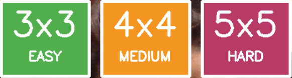

# 🪟Live Chaptcha Challenge

**Live Captcha Challenge** adalah permainan puzzle interaktif berbasis webcam yang memanfaatkan Hand Tracking (MediaPipe Hands) untuk menggerakkan dan menukar blok-blok puzzle secara real-time. Pemain menggunakan gesture pinch untuk mengambil potongan puzzle yang menampilkan bagian tertentu dari video webcam, kemudian menyusunnya kembali hingga membentuk tampilan utuh.

> **Tugas Besar Mata Kuliah Multimedia (IF25-40305)**  
> Informatika – Institut Teknologi Sumatera


## 👥 Anggota Kelompok

| Nama                           | NIM        | GitHub            | Jobdesk                                          |
| ------------------------------ | ---------- | ----------------- | ------------------------------------------------ |
| **Asavira Azzahra**            | 122140067  | [asaviraazzahra](https://github.com/asaviraazzahra)    | Sound & Audio Integration                        |
| **Dinda Joycehana**            | 122140048  | [dindajoycehana](https://github.com/dindajoycehana)     | Hand Landmarking & Gesture Recognition (MediaPipe) |
| **Hizkia Christovita Siahaan** | 122140110  | [HizkiaSiahaan](https://github.com/hizkiasiahaan)     | Camera Module & Frame Processing                 |

---

## 📋 Deskripsi

Live Captcha Challenge merupakan permainan puzzle berbasis video real-time yang dibuat dari feed webcam. Setiap potongan puzzle berasal dari bagian berbeda dari frame webcam, sehingga pemain harus mengatur ulang potongan tersebut hingga susunan gambar kembali utuh.

Interaksi dalam permainan dilakukan menggunakan gesture tangan, terutama gesture pinch (🤏), yang memberikan pengalaman bermain tanpa menyentuh keyboard atau mouse.

Program ini bekerja sebagai bentuk “Captcha interaktif” dimana pemain perlu menyusun ulang gambar webcam untuk membuktikan bahwa ia adalah manusia—namun dalam format game yang lebih menarik.

## 🎯 Fitur

- ✅ **Hand tracking real-time** menggunakan MediaPipe
- ✅ **Gesture pinch and open** untuk mengambil dan memindahkan puzzle
- ✅ **Puzzle dinamis dari live webcam feed**
- ✅ **Movement Counter** untuk menghitung jumlah pergeseran puzzle
- ✅ **Border merah** untuk indikator puzzle yang di *pinch*
- ✅ **Border hijau** untuk indikator posisi yang benar
- ✅ **Overlay Layar kemenangan** ketika puzzle selesai tersusun
- ✅ **Efek suara** klik dan kemenangan
- ✅ **Restart and play again** 

## 🎮 Cara Bermain

1. Jalankan program dan pilih **Level Kesulitan (Easy, Medium, Hard)** dengan mengklik salah satu level untuk memulai permainan.
2. Gunakan gesture **pinch 🤏** (ibu jari + telunjuk disatukan) untuk mengambil satu blok puzzle.
3. Geser tangan sambil tetap *pinch 🤏* untuk memindahkan blok.
4. Lepaskan *pinch* untuk menukar posisi dua blok.
5. Susun semua blok hingga membentuk tampilan webcam yang utuh.
6. Tekan **`Restart`** untuk mengulang permainan yang sedang berjalan.
7. Tekan **`Play Again`** untuk memulai kembali permainan yang telah selesai.
8. Tekan **`Quit`** untuk keluar.

## 🛠 Instalasi

### Prerequisites
- Python 3.10
- Webcam aktif

### Langkah Instalasi dan Setup Virtual Environment
Buka terminal pada VSCode anda lalu paste perintah dibawah ini. 

1. **Clone repository:**
```bash
git clone https://github.com/dindajoycehana/Captcha_Challenge
cd Captcha_Challenge
```

2. **Setup Virtual Environtment**

Pada penjelasan ini menggunakan environment UV
```bash
pip install uv
```

Atur virtual environment menggunakan python versi 3.10
```bash
uv venv --python=python3.10
```

Aktifkan virtual environment
```bash
.venv\Scripts\activate
```

3. **Install dependencies:**

Seluruh kebutuhan dependecies sudah tersedia pada requirements.txt. Sehingga anda dapat menginstalnya menggunakan 1 baris perintah ini pada terminal anda

```bash
uv pip install -U -r requirements.txt
```

## 🚀 Menjalankan Game
```bash
python main.py
```

## 📁 Struktur Proyek

<pre>
Captcha_Challenge/
│
├── main.py                     # Entry point aplikasi
├── requirements.txt            # Dependencies
├── README.md                   # Dokumentasi proyek
│
├── assets/                     # Asset pendukung
│   └── sounds/                 # File efek suara (klik, kemenangan)
│
├── game/                       # Package utama
│   ├── __init__.py             # Inisialisasi package + test audio
│   ├── puzzle.py               # Main game loop & logika permainan
│   ├── hand_tracker.py         # Hand tracking & pinch gesture (MediaPipe)
│   ├── puzzle_pieces.py        # Struktur & logika potongan puzzle
│   ├── game_renderer.py        # Rendering visual puzzle (OpenCV)
│   └── sound.py                # Modul pemutar efek suara
│
└── __pycache__/                # Cache Python (auto-generated)
    └── ...                     # File .pyc hasil kompilasi Python
</pre>


## 🔧 Teknologi yang Digunakan
- OpenCV — menangkap & memproses video webcam 
- MediaPipe — hand landmarking dan gesture recognition
- NumPy — operasi array dan segmentasi frame
- Pygame — efek suara 

## Variasi Kesulitan



## 🐛 Troubleshooting
**Webcam tidak terdeteksi**
- Tutup aplikasi lain yang menggunakan webcam
- Berikan permission webcam pada Python/Terminal
- Restart VSCode atau interpreter

**Hand tracking tidak akurat**
- Pencahayaan cukup
- Tangan 30–50 cm dari webcam
- Background tidak gelap

**Error instalasi dependencies**
```bash
pip install --upgrade pip
```
```bash
pip install -U -r requirements.txt
```

## Logsheet Pengerjaan
| Tanggal         | Aktivitas                                                                                                                                   | Penanggung Jawab       |
| --------------- | ------------------------------------------------------------------------------------------------------------------------------------------- | ---------------------- |
| **7 Nov 2025**  | Membuat repository, menambahkan kolaborator, menyiapkan environment, menginstal dependensi, dan mencoba hand landmarking menggunakan webcam | Dinda                  |
| **10 Nov 2025** | Menambahkan modul suara menggunakan Pygame dan membuat README awal                                                                          | Asavira                |
| **11 Nov 2025** | Memperbarui README                                                                                                                          | Asavira                |
| **1 Des 2025**  | Membuat grid puzzle, logika puzzle, serta melakukan slicing frame                                                                           | Hizkia                 |
| **1 Des 2025**  | Mengimplementasikan hand tracking dan gesture, mengintegrasikannya ke puzzle, serta memperbarui dependensi pada `requirements.txt`          | Dinda                  |
| **6 Des 2025**  | Menambahkan efek suara dan mengintegrasikannya dengan pergerakan puzzle; memperbarui README                                                 | Asavira                |
| **11 Des 2025** | Memperbarui tampilan GUI captcha dan menambahkan level kesulitan                                                                            | Hizkia                 |
| **11 Des 2025** | Memperbaiki akurasi hand tracking pada perubahan grid size                                                                                  | Dinda                  |
| **11 Des 2025** | Menyusun dokumentasi laporan dan memperbarui README                                                                                         | Asavira, Dinda         |
| **12 Des 2025** | Melakukan final testing dan pembuatan video demo                                                                                            | Dinda, Asavira, Hizkia |

## 📝 License
Project ini dibuat untuk tujuan edukasi dan demonstrasi tugas kuliah.

# Selamat bermain! 🎮✨